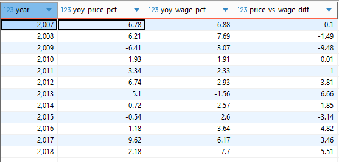
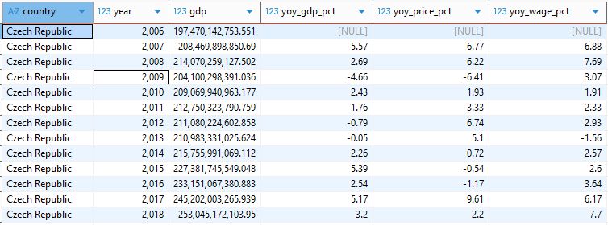

# Analýza vývoje mezd, cen potravin a HDP v ČR (2006–2018)

Tento projekt se zaměřuje na datovou analýzu vývoje průměrných mezd, cen vybraných potravin a hrubého domácího produktu (HDP) v České republice mezi lety 2006 a 2018. Cílem bylo zodpovědět několik konkrétních otázek pomocí nástroje SQL a vyhodnotit ekonomické souvislosti:

*1. Rostou v průběhu let mzdy ve všech odvětvích, nebo v některých klesají?  
2. Kolik je možné si koupit litrů mléka a kilogramů chleba za první a poslední srovnatelné období v dostupných datech cen a mezd?  
3. Která kategorie potravin zdražuje nejpomaleji (je u ní nejnižší percentuální meziroční nárůst)?   
4. Existuje rok, ve kterém byl meziroční nárůst cen potravin výrazně vyšší než růst mezd (větší než 10 %)?  
5. Má výška HDP vliv na změny ve mzdách a cenách potravin? Neboli, pokud HDP vzroste výrazněji v jednom roce, projeví se to na cenách potravin či mzdách ve stejném nebo následujícím roce výraznějším růstem?*

Součástí analýzy bylo vytváření agregačních přehledů, výpočty meziročních změn, použití funkcí jako LAG, PERCENTILE_CONT pro výpočet mediánu, práce s CTE a pohledy (views). 

SQL scripty s dotazy zde [SQL_Scripts](./Scripts)

## Použité nástroje
Pro analýzu cen potravin a HDP jsem využil následující nástroje:
  - **SQL:**  Základní nástroj, pomocí kterého jsem se dotazoval do databáze a získával klíčové informace.
  - **PostgreSQL:** Systém pro správu databází.
  - **DBeaver:** Nástroj pro práci s databází. 
  - **Visual Studio Code:** Použitý především pro správu repozitáře, psaní souboru README.md a základní úpravy projektu.
  - **Git & GitHub:** Sdílení mých skriptů a analýz.

## Vytvoření primární a sekundární tabulky
Před samotnou analýzou dat a odpovězení na konkrétní otázky, bylo nejdříve potřeba si poskytnutá data připravit a to konkrétně vytvořením tabulek, na kterých bude analýza následně uskutečněna.   

### Vytvoření primární tabulky

Pro analýzu bylo nutné nejprve vytvořit primární tabulku, která spojuje data o průměrných mzdách a cenách  potravin. Tabulku jsem vytvořil pomocí několika CTE (common table expresions)
```
CREATE TABLE IF NOT EXISTS t_vladimir_sip_project_SQL_primary_final AS
--1. Vytvoreni CTE prumerne_rocni_mzdy 
WITH wages_by_industry AS (
  SELECT
    cp.payroll_year AS year,
    ib.name AS industry_name,  
    AVG(cp.value) AS avg_wage_czk
  FROM czechia_payroll cp
  JOIN czechia_payroll_value_type vt ON cp.value_type_code = vt.code
  JOIN czechia_payroll_calculation cpc ON cp.calculation_code = cpc.code
  LEFT JOIN czechia_payroll_industry_branch ib ON cp.industry_branch_code = ib.code
  WHERE cp.value_type_code = 5958       
    AND cp.calculation_code = 200       
    AND cp.industry_branch_code IS NOT NULL
    AND cp.value IS NOT NULL
  GROUP BY cp.payroll_year, ib.name
), --2. Vytvoreni CTE prumerne_rocni_ceny
prices AS (
  SELECT
    EXTRACT(YEAR FROM p.date_from) AS year,
    c.code AS category_code,
    c.name AS product_name,  
    ROUND(AVG(p.value)::numeric, 1) AS avg_price_czk
  FROM czechia_price p
  JOIN czechia_price_category c ON p.category_code = c.code
  WHERE p.value IS NOT NULL
  GROUP BY EXTRACT(YEAR FROM p.date_from), c.code, c.name
), --3. Sjednoceni zkoumaneho obdobi
common_years AS (
  SELECT DISTINCT pc.year
  FROM prices pc
  JOIN wages_by_industry wi ON pc.year = wi.year
) -- Finalni vyber
SELECT
  pc.year,
  pc.product_name,
  pc.avg_price_czk,
  wi.avg_wage_czk,
  wi.industry_name
FROM prices pc
JOIN wages_by_industry wi ON pc.year = wi.year
JOIN common_years cy ON pc.year = cy.year
```

**wages_by_industry**  
Obsahuje průměrné roční mzdy dle odvětví. Data byla filtrována tak, aby zahrnovala pouze:

- (value_type_code = 5958) průměrná hrubá mzda 
- (calculation_code = 200) přepočtený na plné pracovní úvazky
- (industry_branch_code IS NOT NULL) odvětví s přiřazeným kódem 
- z důvodu toho, že se nevyskytovala kombinace value_type = 5958 (průměrná hrubá mzda) a unit_code = 80403 (Kč), filtroval sem pouze na základě výše uvedených hodnot.

**prices**  
Obsahuje průměrné roční ceny potravin. Z datumu jsem potřeboval dostat pouze rok, použil jsem funkci ```EXTRACT(YEAR FROM...)```

**common_years**  
Obsahuje pouze ty roky, které jsou společné pro obě tabulky — tedy roky, pro které mám zároveň ceny i mzdy.

**Finální SELECT a spojení dat**  
Pomocí ```JOIN``` jsem spojil všechny tři části do jedné tabulky *t_vladimir_sip_project_SQL_primary_final*. Výsledkem je tabulka s těmito sloupci:

*year* – kalendářní rok

*product_name* – název potraviny

*avg_price_czk* – průměrná cena potraviny v Kč

*avg_wage_czk* – průměrná mzda v Kč

*industry_name* – název odvětví

### Vytvoření sekundární tabulky

Kromě hlavní tabulky s cenami potravin a mzdami bylo potřeba vytvořit i sekundární tabulku, která obsahuje hodnoty hrubého domácího produktu (HDP) České republiky. Tato tabulka slouží k porovnání vývoje HDP s vývojem cen a mezd.

```
CREATE TABLE IF NOT EXISTS t_vladimir_sip_project_SQL_secondary_final AS
WITH common_years AS (
    SELECT 
        DISTINCT YEAR
    FROM t_vladimir_sip_project_SQL_primary_final 
),
economy_cz AS (
    SELECT 
        country,
        YEAR,
        gdp
    FROM economies  
    WHERE country = 'Czech Republic'
)
SELECT 
    country,
    e.YEAR,
    e.gdp
FROM economy_cz e
JOIN common_years cm ON e.YEAR = cm.year
```

**common_years**  
Pomocí ```SELECT DISTINCT```z primární tabulky *t_vladimir_sip_project_SQL_primary_final* jsem získal seznam let, pro které existují údaje o mzdách i cenách.

**economy_cz**   
Z tabulky *economies* jsem vybral pouze řádky, ```WHERE country = 'Czech Republic'```.

**Finální SELECT a spojení dat**  
Pomocí ```JOIN```jsem spojil tyto dvě CTE tabulky a vznikla tabulka *t_vladimir_sip_project_SQL_secondary_final* se sloupci:  
*country*  
*year*  
*gdp* - HDP pro Českou Republiku v letech 2008-2016

# Analýza
### 1. Rostou v průběhu let mzdy ve všech odvětvích, nebo v některých klesají?  

Abych mohl meziročně analyzovat vývoj mezd, nejprve jsem vytvořil pohled v_wages_by_industry nad primární tabulkou t_vladimir_sip_project_SQL_primary_final. 
```
CREATE OR REPLACE VIEW v_wages_by_industry AS
SELECT
  year,
  industry_name,
  MAX(avg_wage_czk) AS avg_wage_czk
FROM t_vladimir_sip_project_SQL_primary_final
GROUP BY year, industry_name;
```
Tento pohled obsahuje agregované průměrné mzdy podle roku a odvětví. Dále jsem vytvořil druhý pohled v_yoy_wage_change, ve kterém pomocí funkce LAG počítám meziroční změnu mezd (year over year) (v absolutních hodnotách i procentech).

```
CREATE OR REPLACE VIEW v_yoy_wage_change AS
WITH yoy AS (
  SELECT
    industry_name,
    year,
    avg_wage_czk,
    LAG(avg_wage_czk) OVER (PARTITION BY industry_name ORDER BY year) AS prev_wage
  FROM v_wages_by_industry
)
SELECT
  industry_name,
  year,
  avg_wage_czk,
  ROUND(avg_wage_czk - prev_wage, 2) AS yoy_wage_abs,
  ROUND( (avg_wage_czk - prev_wage) / NULLIF(prev_wage,0) * 100, 2 ) AS yoy_wage_pct,
  CASE
    WHEN prev_wage IS NULL THEN 'N/A'
    WHEN avg_wage_czk >  prev_wage THEN 'Increased'
    WHEN avg_wage_czk <  prev_wage THEN 'Decreased'
    ELSE 'No change'
  END AS change_label
FROM yoy
WHERE prev_wage IS NOT NULL
ORDER BY industry_name, year;
```
A na závěr jsem vyfiltroval pouze hodnoty 'Decreased' ze sloupce change_label.
```
SELECT *
FROM v_yoy_wage_change 
WHERE change_label = 'Decreased'
```
## Závěr

-  Ve většině odvětví mzdy rostou.

-  Nicméně se vyskytují případy meziročního poklesu mezd, zejména v roce 2013 v sektorech peněžnictví a pojištěnství, energetika či těžba. 


*Heatmap znázorňující meziroční pokles mezd v jednotlivých odvětvích (v %); vygenerováno pomocí ChatGPT s výsledků mého SQL dotazu.*

### 2. Kolik je možné si koupit litrů mléka a kilogramů chleba za první a poslední srovnatelné období v dostupných datech cen a mezd?
Cílem této analýzy bylo zjistit, jak se změnila kupní síla v čase, konkrétně pro dva základní produkty, které kupujeme na denní bázi:
-  Mléko
-  Chléb
```
CREATE OR REPLACE VIEW quantity_affordable AS 
WITH first_and_last_year AS (
  SELECT MIN(year) AS first_year, MAX(year) AS last_year
  FROM t_vladimir_sip_project_sql_primary_final tvspspf 
),
filtered_data AS (
  SELECT *
  FROM t_vladimir_sip_project_SQL_primary_final
  WHERE product_name IN ('Mléko polotučné pasterované', 'Chléb konzumní kmínový')
)
SELECT
  f.product_name,
  f.year,
  ROUND(AVG(f.avg_wage_czk), 2) AS avg_wage_czk,
  ROUND(AVG(f.avg_price_czk), 2) AS avg_price_czk,
  ROUND(AVG(f.avg_wage_czk) / AVG(f.avg_price_czk), 0) AS quantity_affordable
FROM filtered_data f
JOIN first_and_last_year y ON f.year = y.first_year OR f.year = y.last_year
GROUP BY f.product_name, f.year;
```

**first_and_last_year**  
Zjistil jsem první a poslední rok ze sledovaného období pomocí funkce ```MIN``` a ```MAX```.

**filtered_data**  
Vyfiltroval jsem jen zkoumané produkty.

**Finální SELECT a spojení dat**  
Obě tabluky jsem propojil a pomocí vzorce *(průměrná mzda / průměrná cena produktu)* jsem vypočítal kupní sílu. 

## Závěr


**Mléko polotučné pasterované:**   
V roce 2006 bylo možné koupit cca 1 470 litrů, v roce 2018 cca 1 671 litrů.
- Zvýšení dostupnosti o 13.7%.

**Chléb konzumní kmínový:**   
V roce 2006 bylo možné koupit cca 1 315 bochníků, v roce 2018 cca 1 367 bochníků.
- Zvýšení dostupnosti o 4%.

Z toho vyplývá, že i když ceny rostly, růst mezd byl vyšší, což vedlo ke zvýšené dostupnosti těchto základních potravin.


*Sloupcový graf zobrazující množství chleba a mléka, které bylo možné koupit za průměrnou mzdu v letech 2006 a 2018. Vygenerováno pomocí ChatuGPT z výsledků mého SQL dotazu. 

### 3. Která kategorie potravin zdražuje nejpomaleji (je u ní nejnižší percentuální meziroční nárůst)? 
Cílem bylo zjistit, které potraviny zaznamenávají nejpomalejší meziroční růst cen v období 2006–2018.


```
CREATE OR REPLACE VIEW avg_yoy_price_pct AS 
WITH avg_prices AS (
  SELECT
    product_name,
    year,
    ROUND(AVG(avg_price_czk), 2) AS avg_price_czk
  FROM t_vladimir_sip_project_sql_primary_final
  GROUP BY product_name, year
),
price_yoy_change AS (
  SELECT
    product_name,
    year,
    avg_price_czk,
    LAG(avg_price_czk) OVER (PARTITION BY product_name ORDER BY year) AS prev_price
  FROM avg_prices
),
price_with_pct_change AS (
  SELECT
    product_name,
    year,
    avg_price_czk,
    prev_price,
    ROUND(
  ((avg_price_czk - prev_price) / NULLIF(prev_price, 0)) * 100,
  2) AS yoy_price_pct
  FROM price_yoy_change
  WHERE prev_price IS NOT NULL
)
SELECT
  product_name, year, avg_price_czk, prev_price, yoy_price_pct
FROM price_with_pct_change;

SELECT * 
FROM avg_yoy_price_pct aypp 
```
**avg_prices**  
- Výpočet průměrné ceny (avg_price_czk) pro každý produkt za každý rok.   
- Použití ```ROUND(...,2)``` pro zaokrouhlení na 2 desetinná místa.

**price_yoy_change**  
- Pomocí funkce ```LAG()``` jsem získal průměrnou cenu z předchozího roku (prev_price) pro každý produkt.
- ```PARTITION BY product_name``` zajistí, že se porovnává pouze v rámci jednoho produktu.
- ```ORDER BY year``` zajišťuje časové řazení.

**price_with_pct_change**
-  Spočítá meziroční procentuální změnu ceny (yoy_price_pct) pro každý produkt. Ošetříl jsem výpočet proti dělení nulou pomocí funkce ```NULLIF(prev_price, 0)```: Pokud je prev_price = 0, vrať NULL. Jinak vrať prev_price.
 

Výpočet průměrného meziročního růstu ceny za každý produkt:
```
SELECT
  product_name,
  ROUND(AVG(yoy_price_pct), 2) AS avg_yoy_price_pct
FROM avg_yoy_price_pct
GROUP BY product_name
ORDER BY avg_yoy_price_pct ASC;
```
Tento dotaz umožňuje zjistit, které potraviny dlouhodobě zdražují nejpomaleji. Seřazením výsledků vzestupně lze snadno identifikovat produkty s nejnižším průměrným růstem.

## Závěr
Na základě výpočtu průměrného meziročního růstu cen jednotlivých potravin za dostupné roky (2006–2018) lze určit, které potraviny zdražují nejpomaleji.


*Graf, vygenerovaný ChatemGPT z výsledků mého SQL dotazu, který znázorňuje průměrný meziroční růst cen potravin.*  

Z grafu lze vidět, že dvě kategorie v tomto období dokonce zlevňovali a to konkrétně cukr krystalový a rajská jablka. Možné příčiny tohoto poklesu by mohly být:

- Zrušení cukerných kvót v EU (2017) vedlo k růstu produkce a tlaku na pokles cen.
- Nadprodukce na světovém trhu (např. Brazílie, Indie) snižovala ceny surového cukru globálně.
- Dovoz levnějšího cukru po vstupu ČR do EU zvýšil konkurenci a srazil ceny.

### 4. Existuje rok, ve kterém byl meziroční nárůst cen potravin výrazně vyšší než růst mezd (větší než 10 %)?

Cílem této analýzy bylo zjistit, zda ceny potravin rostly rychleji než mzdy. Výpočet byl proveden na základě průměrných meziročních změn obou veličin.
```
CREATE OR REPLACE VIEW price_vs_wage_diff AS 
WITH avg_prices AS (
    SELECT 
        year,
        AVG(avg_price_czk) AS avg_price
    FROM t_vladimir_sip_project_sql_primary_final
    GROUP BY year
),
avg_wages AS (
    SELECT 
        year,
        AVG(avg_wage_czk) AS avg_wage
    FROM t_vladimir_sip_project_sql_primary_final
    GROUP BY year
),
combined AS (
    SELECT 
        p.year,
        p.avg_price,
        w.avg_wage,
        LAG(p.avg_price) OVER (ORDER BY p.year) AS prev_price,
        LAG(w.avg_wage) OVER (ORDER BY w.year) AS prev_wage
    FROM avg_prices p
    JOIN avg_wages w ON p.year = w.year
),
change_analysis AS (
    SELECT
        year,
        ROUND(((avg_price - prev_price) / prev_price * 100)::NUMERIC, 2) AS yoy_price_pct,
        ROUND(((avg_wage - prev_wage) / prev_wage * 100)::NUMERIC, 2) AS yoy_wage_pct,
        ROUND((((avg_price - prev_price) / prev_price * 100) - ((avg_wage - prev_wage) / prev_wage * 100))::NUMERIC, 2) AS price_vs_wage_diff
    FROM combined
    WHERE prev_price IS NOT NULL AND prev_wage IS NOT NULL
      AND prev_price <> 0 AND prev_wage <> 0
)
SELECT *
FROM change_analysis;

```
**avg_priceses**  
Výpočet průměrné ceny potravin za každý rok ```AVG(avg_price_czk) AS avg_price```

**avg_wageses**
Výpočet průměrných mezd za každý rok stejným způsobem.

**combined**  
Spojení tabulek a přidání předchozích hodnot (LAG) pro výpočet meziročních změn.

**change_analysis**
Výpočet klíčových ukazatelů:  

*yoy_price_pct* = meziroční růst cen potravin v %

*yoy_wage_pct* = meziroční růst mezd v %

*price_vs_wage_diff* = rozdíl mezi těmito dvěma hodnotami (pozitivní = ceny rostly rychleji než mzdy)

## Závěr
  

Z výstupní tabulky vyplývá, že v žádném roce nebyl rozdíl mezi navýšením cen potravin a navýšením mezd vyšší než 10?. Největší rozdíl byl zaznamenán v roce 2013, kdy průměrná mzda klesla o 1,56 %, zatímco průměrná cena potravin vzrostla o 5,1 %. Je potřeba mít na vědomí, že toto číslo může být ovlivněno cenovými skoky u levnějších položek, jejichž podíl na celkových výdajích domácností je zanedbatelný. Naproti tomu i malý meziroční růst mezd může znamenat stovky korun navíc měsíčně, a tedy větší reálný vliv na kupní sílu. 


*Sloupcový graf znázorňující meziroční procentuální změny cen potravin v roce 2009 (oproti roku 2008). ChatGPT vygeneroval tento graf s výsledků SQL dotazu.*
```
WITH prices_with_lag AS (
  SELECT
    product_name,
    year,
    AVG(avg_price_czk) AS avg_price,
    LAG (AVG(avg_price_czk)) OVER (PARTITION BY product_name ORDER BY year) AS prev_price
  FROM t_vladimir_sip_project_sql_primary_final
  GROUP BY product_name, year
)
SELECT 
  product_name,
  avg_price AS price_2009,
  prev_price AS price_2008,
  ROUND(((avg_price - prev_price) / prev_price) * 100, 2) AS yoy_price_pct
FROM prices_with_lag
WHERE year = 2009 AND prev_price IS NOT NULL
ORDER BY yoy_price_pct ASC;
```

### 5. Má výška HDP vliv na změny ve mzdách a cenách potravin?

Pro tuto analýzu jsem zjistil procentuelní meziroční změnu HDP a tuto změnu porovnával s již vypočítanou meziroční změnou cen produktů a mezd.  

```
CREATE OR REPLACE VIEW v_gdp_price_wage AS 
WITH gdp_cte AS (
    SELECT 
        country,
        YEAR,
        gdp,
        LAG(gdp) OVER (ORDER BY year) AS prev_gdp
    FROM t_vladimir_sip_project_SQL_secondary_final tf
),
avg_prices AS (
    SELECT year,
           ROUND(AVG(avg_price_czk), 2) AS avg_price
    FROM t_vladimir_sip_project_sql_primary_final
    GROUP BY year
),
avg_wages AS (
    SELECT year,
           ROUND(AVG(avg_wage_czk), 2) AS avg_wage
    FROM t_vladimir_sip_project_sql_primary_final
    GROUP BY YEAR
),
combined AS (
    SELECT 
        g.country,
        g.YEAR,
        g.gdp,
        g.prev_gdp,
        ap.avg_price,
        LAG(ap.avg_price) OVER (ORDER BY g.year) AS prev_price,
        aw.avg_wage,
        LAG(aw.avg_wage) OVER (ORDER BY g.year) AS prev_wage
    FROM gdp_cte g
LEFT JOIN avg_prices ap ON g.YEAR = ap.YEAR
LEFT JOIN avg_wages aw ON g.YEAR = aw.year
)
SELECT 
    country,
    YEAR,
    gdp,
    ROUND(((gdp - prev_gdp) / prev_gdp * 100)::NUMERIC, 2) AS yoy_gdp_pct,
    ROUND(((avg_price - prev_price) / prev_price * 100)::NUMERIC, 2) AS yoy_price_pct,
    ROUND(((avg_wage - prev_wage) / prev_wage * 100)::NUMERIC, 2) AS yoy_wage_pct
FROM combined
ORDER BY YEAR;
```
## Závěr


Při porovnání meziročních změn HDP, mezd a cen potravin lze vypozorovat určitou korelaci mezi růstem HDP a mzdami – ve většině případů se jejich trend pohybuje stejným směrem. Naopak mezi HDP a cenami potravin taková viditelná korelace není. Ceny potravin se často mění bez ohledu na vývoj HDP – mohou růst i v letech ekonomického poklesu, jak je vidět v roce 2012. 

## Co jsem se naučil

Během tohoto projektu jsem se naučil pracovat s reálnými daty o cenách potravin, mzdách a HDP v prostředí SQL. Při analýze jsem postupně zdokonalil následující dovednosti:

-  Pokročilý návrh SQL dotazů: Získal jsem zkušenosti s tvorbou složitějších SQL dotazů, efektivním spojováním tabulek a využíváním WITH (CTE - Common Table Expressions) pro lepší čitelnost a přehlednost.

-  Naučil jsem se používat GROUP BY, AVG(), COUNT() a ROUND()...

-  Meziroční srovnání: Osvojil jsem si práci s funkcí LAG() pro výpočet meziročních změn cen, mezd nebo HDP.

-  Kombinace více datových zdrojů: Úspěšně jsem propojil různé tabulky (cenová data, mzdy, HDP) a vytvořil z nich jednotné přehledy pro hlubší analýzu vztahů mezi nimi.

-  Analytické myšlení: Zlepšil jsem schopnost převádět reálné otázky (např. „Zdražují potraviny rychleji než rostou mzdy?“) do SQL dotazů.


